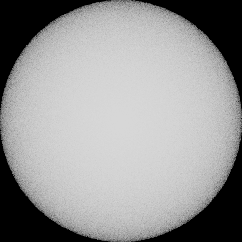

# Procedural Renderer for FBKSD

A procedural renderer for the [FBKSD](https://github.com/fbksd/fbksd) system.

## Introduction

The renderer renders mathematical expressions using the [ExprTk](http://www.partow.net/programming/exprtk/index.html)
syntax.

The mathematical expression gets random parameters as inputs, and writes the result to features.
The available random parameters and features come from the FBKSD system.

## Scene Description

The scene description is a text file with two sections separated by a `#`.
The first section sets the width, height, and number of samples.
The second defines the mathematical expression used to compute the features.

The following scene defines 3D sphere centered in the (0, 1]^3 domain.
It gets the `IMAGE_X`, `IMAGE_Y`, and `TIME` input random parameters, maps them to the sphere domain as a (x, y, z) point, and checks if the point is inside the sphere.
If it is, the value 1.0 is written to the output color.

```
width := 500;
height := 500;
spp := 64;

#

var c[3] := { 0.5, 0.5, 0.5 };
var r_sq := 0.5^2;
var d := ((IMAGE_X/width) - c[0])^2 + ((IMAGE_Y/height) - c[1])^2 + (TIME - c[2])^2;

COLOR_R := d <= r_sq ? 1.0 : 0.0;
COLOR_G := COLOR_R;
COLOR_B := COLOR_R;
```

Result:

